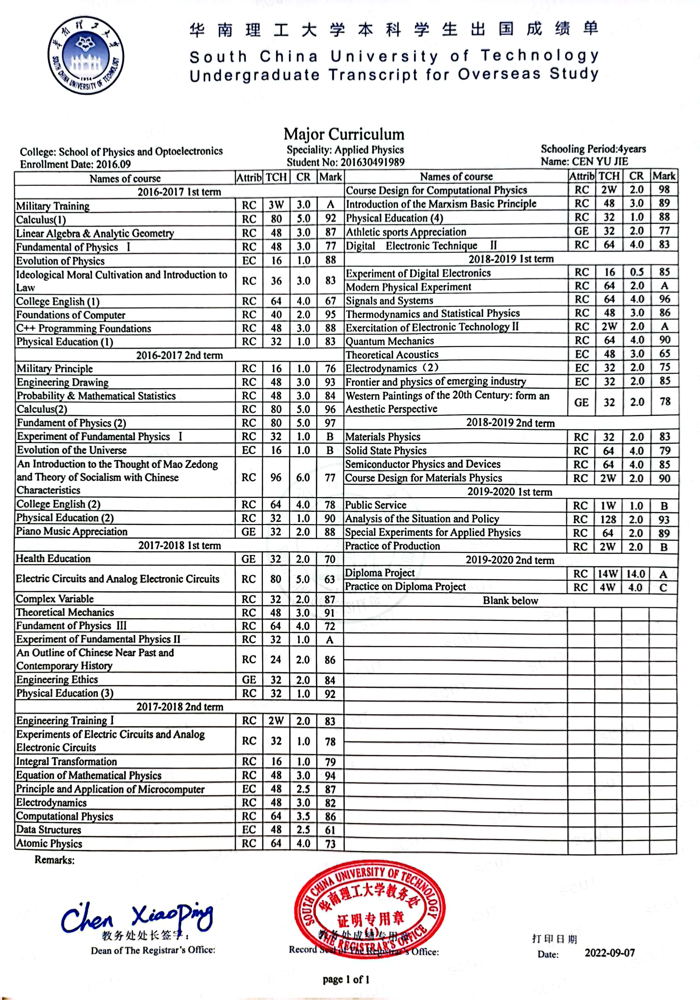
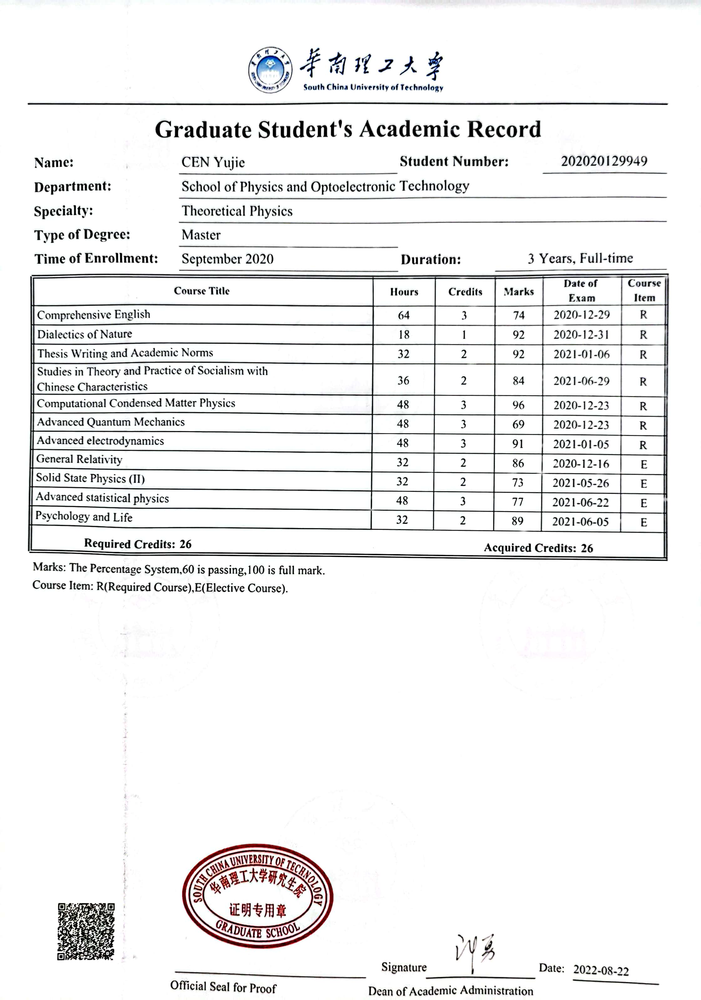
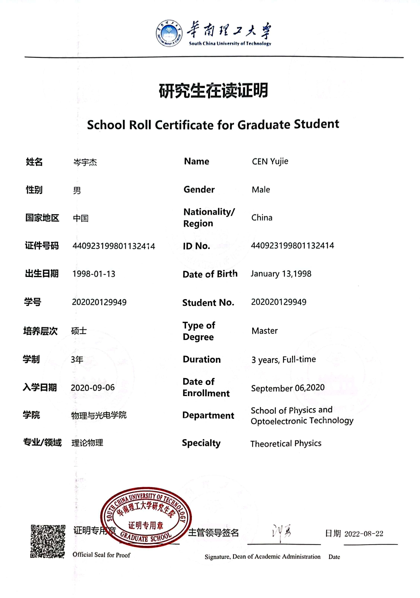

# 
 Referees information  

**Prof. Xiao-Bao Yang  (Mentor)**   
E-mail: scxbyang@scut.edu.cn  
ResearchGate: https://www.researchgate.net/profile/Xiao-Bao-Yang  
Research group: [Computational Condensed Matter Physics Group](http://www.compphys.cn/index.php)

**Prof. Yu-Jun Zhao  (Co-Mentor)**   
E-mail: zhaoyj@scut.edu.cn  
ResearchGate: https://www.researchgate.net/profile/Yu-Jun-Zhao  
Research group: [Computational Condensed Matter Physics Group](http://www.compphys.cn/index.php)